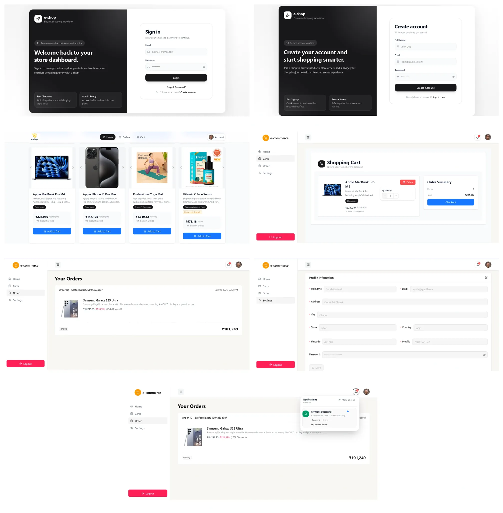
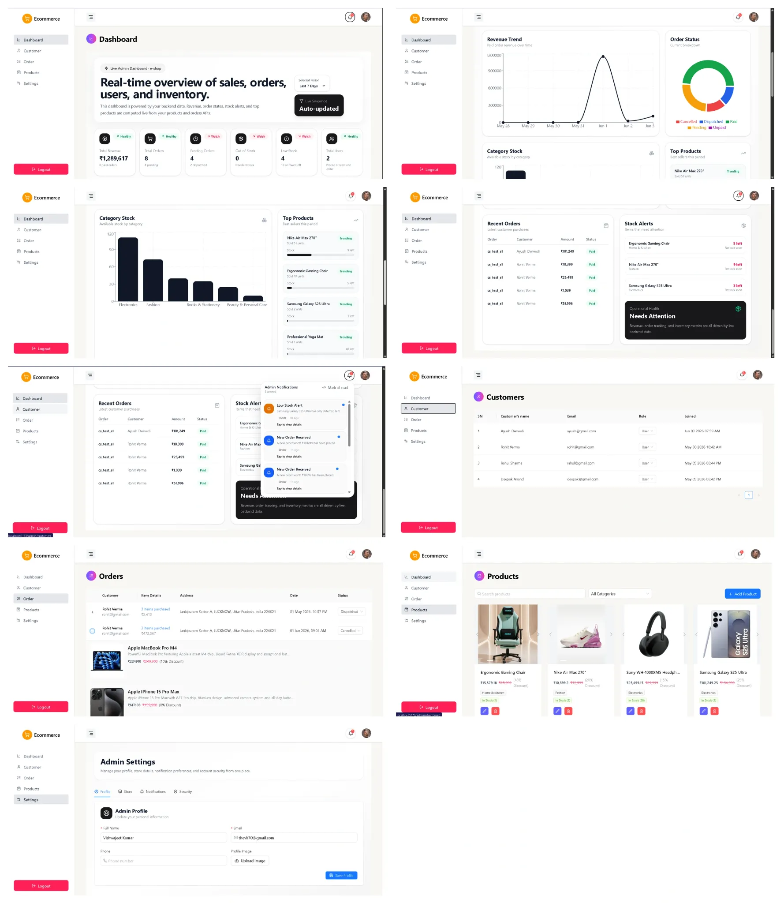

# 🛒 e-shop

A modern full-stack E-Commerce platform built with the MERN Stack featuring secure authentication, Stripe payment integration, inventory management, notifications, and a professional admin dashboard.

---

## 🚀 Live Features

### 👤 User Features

- User Registration & Login
- Browse Products
- Product Image Carousel
- Add To Cart
- Update Cart Quantity
- Secure Stripe Checkout
- Order History
- User Notifications
- Profile Settings
- Responsive Design

### 👨‍💼 Admin Features

- Dashboard Analytics
- Product Management
- Order Management
- Customer Management
- Notification Center
- Inventory Management
- Low Stock Alerts
- Out Of Stock Alerts
- Store Settings
- Revenue Tracking

---

## 🏗️ Tech Stack

### Frontend

- React.js
- React Router DOM
- Zustand
- SWR
- Axios
- Tailwind CSS
- Ant Design
- Lucide React
- React Toastify
- Formik
- Yup
- Moment.js

### Backend

- Node.js
- Express.js
- MongoDB Atlas
- Mongoose
- JWT Authentication
- Stripe Payment Gateway
- Bcrypt

---

## 📁 Project Structure

```bash
e-shop
│
├── frontend
│   ├── src
│   ├── public
│   ├── package.json
│   └── .env
│
├── backend
│   ├── src
│   │   ├── auth
│   │   ├── carts
│   │   ├── checkout
│   │   ├── notifications
│   │   ├── orders
│   │   ├── products
│   │   └── users
│   │
│   ├── package.json
│   └── .env
│
└── README.md
```

---

# ⚙️ Environment Variables

## Frontend (.env)

Create a `.env` file inside the frontend directory.

```env
VITE_SERVER_URL=http://localhost:8080
```

---

## Backend (.env)

Create a `.env` file inside the backend directory.

```env
PORT=8080

MONGO_URL=your_mongodb_connection_string

JWT_SECRET=your_jwt_secret

S_KEY=your_stripe_secret_key

STRIPE_WEBHOOK_SECRET=your_stripe_webhook_secret

FRONTEND_URL=http://localhost:5173

PAYMENT_SUCCESS_URL=http://localhost:5173/users/orders

PAYMENT_FAILED_URL=http://localhost:5173/users/carts
```

---

# 📦 Installation

## Clone Repository

```bash
git clone https://github.com/your-username/e-shop.git

cd e-shop
```

---

## Backend Setup

```bash
cd backend

npm install

npm run dev
```

Backend Server:

```bash
http://localhost:8080
```

---

## Frontend Setup

```bash
cd frontend

npm install

npm run dev
```

Frontend Server:

```bash
http://localhost:5173
```

---

# 💳 Stripe Webhook Setup

Install Stripe CLI:

```bash
stripe login
```

Run listener:

```bash
stripe listen --forward-to localhost:8080/checkout/webhook
```

Copy generated webhook secret:

```env
STRIPE_WEBHOOK_SECRET=whsec_xxxxxxxxxxxxxxxxx
```

Update your backend `.env` file.

---

# 🔔 Notification System

## User Notifications

- Payment Successful
- Order Placed
- Order Dispatched
- Order Cancelled

## Admin Notifications

- New Order Received
- Product Added
- Product Updated
- Product Deleted
- Low Stock Alert
- Out Of Stock Alert

---

# 📊 Admin Dashboard

Dashboard provides:

- Total Revenue
- Total Orders
- Total Products
- Total Customers
- Recent Orders
- Revenue Statistics
- Inventory Overview
- Notification Center

---

# 🛍️ E-Commerce Workflow

```text
User Signup/Login
        ↓
Browse Products
        ↓
Add Products To Cart
        ↓
Checkout Using Stripe
        ↓
Webhook Verification
        ↓
Order Created
        ↓
Stock Updated
        ↓
Notifications Generated
```

---

# 🔐 Security Features

- Protected Routes
- Role-Based Access Control
- Password Hashing with Bcrypt
- Stripe Webhook Verification
- Secure Checkout Process

---

# 📸 Screenshots

Add screenshots of:

- Home Page
- Login Page
- Signup Page
- Product Listing
- Cart Page
- Checkout Page
- Orders Page
- User Dashboard
- Admin Dashboard
- Product Management
- Notification System

Example:

```md
## User Screens



## Admin Screens


```

---

# 🌟 Future Enhancements

- Forgot Password via Email OTP
- Product Reviews & Ratings
- Wishlist
- Coupon System
- Real-Time Notifications
- Sales Reports Export
- Multi-Vendor Marketplace

---

# 🤝 Contributing

Contributions, issues, and feature requests are welcome.

Feel free to fork this repository and submit a pull request.

---

# 👨‍💻 Author

**Vishwajeet Kumar**

Full Stack MERN Developer

Built with ❤️ using React, Node.js, MongoDB, Stripe and Tailwind CSS.
